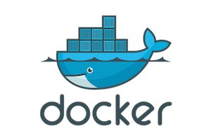

<div class="top-section-home">
    <div class="logo-section"></div>
    
    <div class="title-section">
    {{site.title}}
    </div>
    
    <div class="subtitle-section">
    {{site.description}}
    </div>
    
    <div class="badges">
        <span>
            <a href="https://github.com/verdaccio/verdaccio">
                
            </a>
        </span>
        <span>
            <a href="https://www.npmjs.org/package/verdaccio">
                
            </a>
        </span>
        <span>
            <a href="https://www.npmjs.org/package/verdaccio">
                
            </a>
        </span>
    </div>
    
    <div class="link-section">
        <a href="https://github.com/verdaccio" title="Github verdaccio page">GitHub</a>
        <a href="https://github.com/verdaccio/verdaccio/tree/master/wiki" title="Documentation">Documentation</a>   
    </div>
       
       
</div>


## Easy to Install

One command install

```sh
npm install --global verdaccio

# or

yarn global add verdaccio

```

## Easy to Use

Set your verdaccio registry as default

```sh

npm set registry http://localhost:4873/

```

## DevOps Friendly

<a href="https://github.com/verdaccio/verdaccio/blob/master/wiki/docker.md" target="_blank">
    
</a>

## Most popular npm clients supported

<div class="client-support">
    <div class="client">
        
    </div>
    <div class="client">
        
    </div>        
</div>

